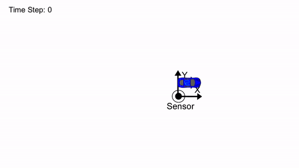
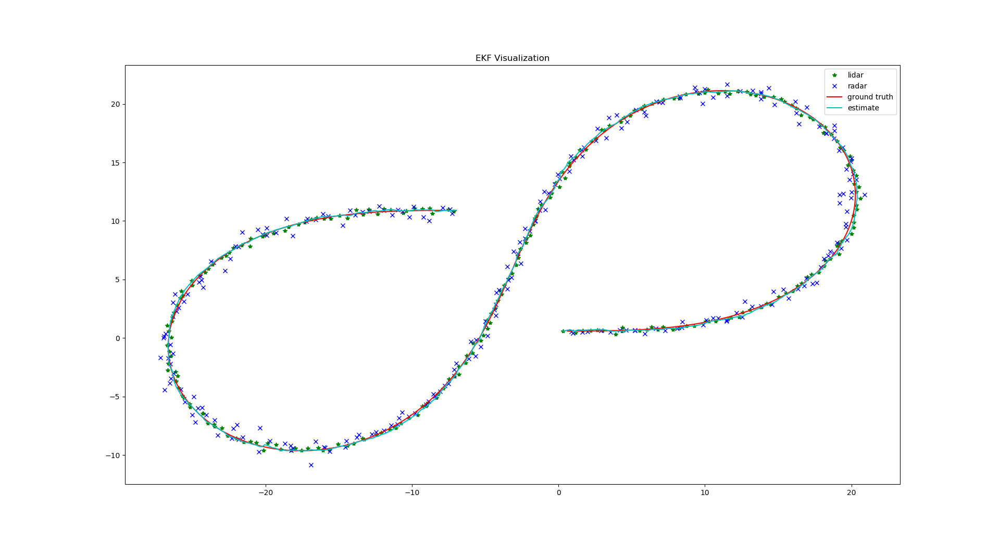
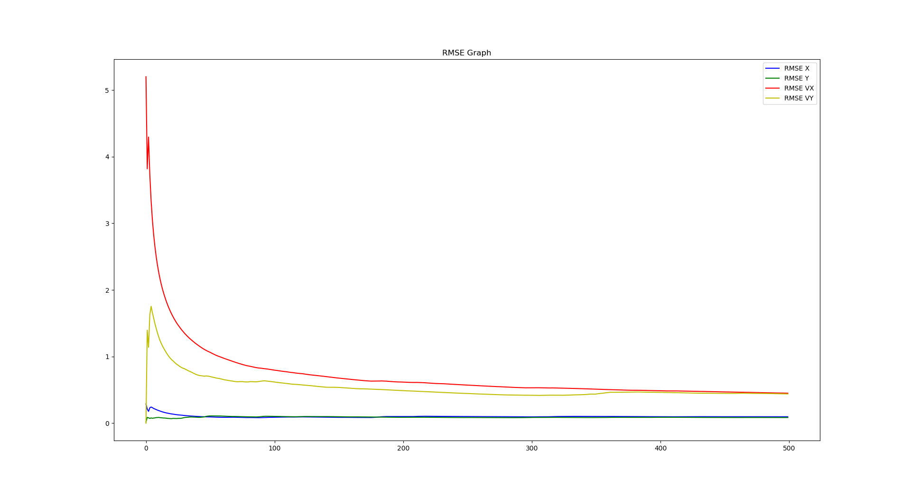

# Sensor fusion with Extended Kalman filter

## Overview

This project utilizes an extended Kalman filter to estimate the state of a moving object of interest with noisy LIDAR and RADAR measurements.

## Dependencies
* [Simulator](https://github.com/udacity/self-driving-car-sim/releases)
* [uWebSockets](https://github.com/uWebSockets/uWebSockets)
* cmake
* gcc/g++
* make
* openssl
* libuv
* zlib

## Build Instructions
1. Clone this repo.
2. Make a build directory: `mkdir build && cd $_`
3. Compile: `cmake .. && make`

## Run Instructions
* To run with sample data `./ExtendedKF input_file <output_file>`
* To run with simulator `./ExtendedKF`

## Plotting data
Input and output data can be plotted using `plot.py`.

Usage: `python plot.py input_data.txt output_data.txt`

## Accuracy

The following image shows the EKF estimates:

The following shows change in RMSE over time:

The EKF accuracy was:
* Dataset 1 : RMSE <= [0.0973, 0.0855, 0.4513, 0.4399]
* Dataset 2 : RMSE <= [0.0726, 0.0965, 0.4216, 0.4932]
